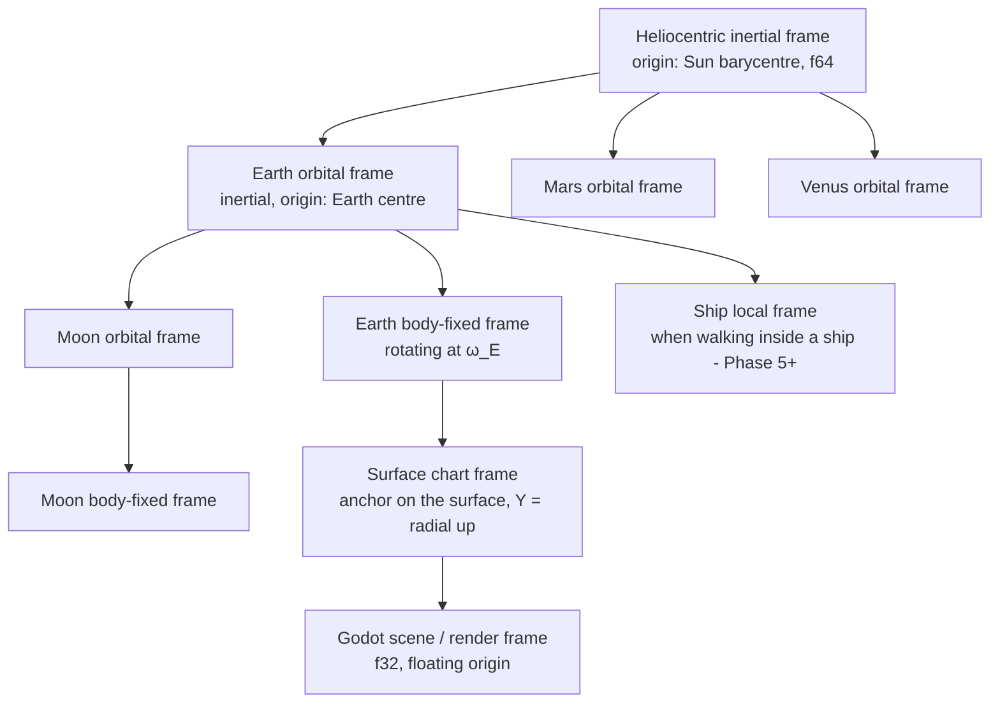

# COSMOS-ARCHITECTURE — VOXIVERSE as a Toy Cosmological Sandbox

Status: **RESEARCH + LOCKED LAYERED DESIGN (the map, not the last-detail spec).** This document
is the authoritative architecture for turning VOXIVERSE — today a flat-Earth, browser-served,
Minecraft-like voxel sim (Godot 4.4.1 + godot_voxel, WebGL2/GL-Compatibility, threaded WASM) —
into a **continuous, physically-grounded, 1:1000-scale solar system you can play in without a
single loading screen**. It consolidates a state-of-the-art survey (§3, with sources) and a
multi-layer architecture (§4) into a phased roadmap (§6). Each layer names the follow-up
dedicated design pass it needs (§7); those passes refine, they do not relitigate, the shape
locked here.

Read together with: `docs/DESIGN.md` (current milestone scope), `docs/LOD-RESEARCH.md` +
`docs/LOD-DESIGN.md` (the far-field terrain layer, branch `feat/voxiverse-lod` — the seed of
astro-LOD), `docs/SIM-MODEL.md` (the decoupled sim layer this design extends), and the
long-term memory specs (physical objects, per-voxel fields, dormant-by-default physics).

---

## 0. Executive summary

**The vision** (§1, locked): worlds are real spherical planets and moons at 1:1000 scale
(1 block = 1 m; Earth radius ≈ 6,371 blocks; Earth–Sun ≈ 1.496×10⁸ blocks). Planets spin and
orbit; moons orbit planets; ships, players and NPCs obey (simplified) Newtonian mechanics in
one unstitched continuous space — surface ↔ orbit ↔ interplanetary with no teleports, no fake
skyboxes. On the surface it is still Minecraft; in the sky, every other body is rendered at
its true position via LOD.

**The verdict, stated honestly up front: the full vision is web-feasible** — *because* of, not
despite, four architectural commitments:

1. **No scene coordinate ever exceeds a few tens of kilometres.** The universe lives in a
   hierarchy of reference frames whose transforms are computed in 64-bit scalars (GDScript
   `float` is already a 64-bit double, full-speed in WASM); the Godot scene graph only ever
   holds *local-frame* positions near a floating origin. Float32 — and therefore godot_voxel,
   the Compatibility renderer, and WebGL2 shaders — never sees a large number. No
   `precision=double` engine rebuild is required (§3.1, §4.1).
2. **The planet is a global cube-sphere voxel lattice, but the *runtime* only ever
   instantiates a local gnomonic chart of it** — a rectilinear (u, v, r) grid that today's
   entire engine (godot_voxel, the analytic physics, the edit overlay, the collapse pass)
   treats as its ordinary flat world with `y ↦ r`. Surface play stays byte-for-byte Minecraft;
   sphericity lives in the terrain function and the far/LOD layers (§4.3).
3. **Orbital mechanics is on-rails Keplerian ephemeris + local numeric integration** — the KSP
   architecture, which is also *exactly* the engine's existing dormant-by-default physics law
   generalized: an undisturbed object in vacuum is not simulated, it is *on a rail* (a conic,
   evaluated closed-form from time). Only disturbed objects integrate (§4.2, §4.4).
4. **The scaled system is dynamically self-consistent.** Scaling all lengths ×10⁻³ and all
   times ×(1/√1000 ≈ 1/31.62) yields a Kepler-exact miniature with **surface gravities
   preserved** (Earth 9.81 m/s²), all angular sizes in the sky preserved (the Moon and Sun
   still subtend ~0.5°), orbital velocity at Earth's surface ≈ 250 m/s, a year of 11.5 days
   and a 45.5-minute day — playable numbers throughout (§1.2).

**The single biggest risks** (each gets a mitigation and a phase gate in §6):

| # | Risk | Why it is the risk | Mitigation locked here |
|---|---|---|---|
| R1 | **Blocky voxels on a sphere** — grid topology, chart re-anchoring, face seams | No shipped game has done *Minecraft-feel blocky* play on a true voxel sphere; Space Engineers went smooth-ish, Outer Wilds went non-voxel | Global cube-sphere lattice + local gnomonic chart (§4.3); re-anchor pop bounded ≤ ~0.4 blocks at the fog edge; face seams deferred to a dedicated pass (§7) and physically rare (< 1% of surface) |
| R2 | **Chart re-anchor restream cost** on the single web voxel worker | Re-anchoring ≈ teleporting the near field 256 m; the web build has ONE voxel thread (`project.godot:63-64`) | Hysteretic 256 m anchor steps, amortized restream, measured as the Phase 1 exit gate |
| R3 | **WASM memory ceiling** (browser heap 2–4 GB) with planet LOD + near field + far field | Everything else is CPU-shaped; memory is the hard wall on web | Budget ladder in §5; per-band hard caps in the FarTerrain style (`far_terrain.gd:44-46`, branch) |
| R4 | **Determinism of the ephemeris across platforms** (libm trig differences) | Time-warp + multiplayer both want bit-stable body positions | Own minimax sin/cos in the frame library; flagged open question §7 |
| R5 | **Scope**: this is a multi-milestone program, not a feature | — | Six independently-demoable phases (§6), each shippable to the live site |

If any part of the vision is *not* web-first, it is: very large persistent debris fields
(thousands of awake bodies), and full n-body integration for everything — both excluded by
design (dormancy + rails), not by hardware. A native desktop target would relax memory and
allow a `precision=double` build as a luxury, but **nothing below requires one**.

---

## 1. The locked vision, restated precisely

These are requirements, not aspirations. Every layer in §4 exists to satisfy one of them.

- **V1 — Real worlds.** Playable worlds are (small) planets or moons with real orbital
  mechanics: planets **spin** about their axis and **orbit** their parent (star or planet);
  moons orbit planets; planets orbit the star. Positions come from a deterministic ephemeris,
  not decoration.
- **V2 — Spherical voxel planets.** A planet's surface and interior are enclosed in its voxel
  representation; a planet may have an atmosphere and has gravity pointing toward its centre.
- **V3 — One continuous space.** Players, NPCs and objects move uninterruptedly
  surface ↔ orbit ↔ interplanetary space. **No loading screens, no teleports, no fake
  skyboxes.** Anything visible in the sky is at its true (scaled) position and true angular
  size, rendered through LOD.
- **V4 — Minecraft on the surface.** On/near a planet surface the experience is today's
  first-person blocky voxel play — dig, place, collapse, hotbar, per-voxel temperature —
  unchanged in feel.
- **V5 — Newtonian small objects.** Ships, players, NPCs, meteorites and comets in space
  follow Newtonian mechanics (patched-conic simplification allowed); their velocity relative
  to bodies defines their orbits/trajectories. Orbital mechanics applies to *everything*,
  not just planets.
- **V6 — The scale law.** Bodies of our Solar System at **1:1000 linear scale**, 1 block = 1 m:
  Earth radius ≈ 6,371 blocks; Earth's atmosphere shell ≈ **512 blocks** thick (deliberately
  ~5× thicker than a 1:1000 Kármán line, so the atmosphere is a playable place);
  Earth–Sun ≈ 1.496×10⁸ blocks; Earth–Moon ≈ 3.844×10⁵ blocks. The player spawns and plays
  on Earth.

### 1.1 The similarity theorem that makes the toy self-consistent

Scale every length by λ = 10⁻³ and every time by τ = λ^(1/2) = 1/31.6228 (equivalently: scale
every gravitational parameter GM by λ³/τ² = 10⁻⁶ — mass by ~10⁻⁹ at constant G). Then:

- **Kepler dynamics is preserved exactly** (Kepler's third law T² ∝ a³/GM is invariant under
  this scaling), so the scaled ephemeris is literally *the real ephemeris, positions ×10⁻³,
  clock ×31.6228* (§4.2).
- **Surface gravity is preserved**: g = GM/R² scales by 10⁻⁶/10⁻⁶ = 1. Earth pulls at
  9.81 m/s², the Moon at 1.62 m/s² — the existing player controller's tuned feel
  (`player.gd:21`) carries over per-planet as a data value.
- **All angles are preserved** (uniform length scaling): the Moon and the Sun each still
  subtend ≈ 0.5° from Earth's surface; solar eclipses still *just barely* work. "True
  positions in the sky" is scale-invariant — the toy sky is geometrically the real sky.
- **Velocities scale by √λ = 1/31.62**: playable speeds (table below).

### 1.2 The numbers (locked reference table)

Scaled values; real values from JPL (§3.3). "v_circ" = circular orbit speed at the surface.

| Body | Radius (blocks) | Orbit a (blocks) | GM (m³/s²) | Surface g | v_circ / v_esc | Period (scaled) |
|---|---|---|---|---|---|---|
| Sun | 696,340 | — | 1.327×10¹⁴ | 274 | — | — |
| Mercury | 2,440 | 5.79×10⁷ | 2.203×10⁷ | 3.70 | 95 / 134 m/s | year 2.78 d |
| Venus | 6,052 | 1.082×10⁸ | 3.249×10⁸ | 8.87 | 232 / 328 m/s | year 7.11 d |
| **Earth** | **6,371** | **1.496×10⁸** | **3.986×10⁸** | **9.81** | **250 / 354 m/s** | **year 11.55 d; day 45.5 min** |
| Moon | 1,737 | 3.844×10⁵ (about Earth) | 4.905×10⁶ | 1.62 | 53 / 75 m/s | month 20.7 h |
| Mars | 3,390 | 2.279×10⁸ | 4.283×10⁷ | 3.73 | 112 / 159 m/s | year 21.7 d |

Derived gameplay numbers (Earth):

| Quantity | Value | Note |
|---|---|---|
| Low orbit period (surface-grazing) | ≈ 2.7 min | real ~90 min × 1/31.62 |
| Geostationary radius | 42,164 blocks | T_orb = 45.5 min day — exists and is consistent |
| Earth SOI (patched conics) | ≈ 929 km-blocks | scales linearly with a |
| Moon SOI | ≈ 66 km-blocks | |
| Heliocentric speed of Earth | 942 m/s | the Krakensbane-scale number (§3.1) |
| Sea-level horizon (eye 1.7 m) | **≈ 147 blocks** | √(2Rh); *inside* today's 256-block render radius! |
| Horizon from a 100 m peak | ≈ 1,129 blocks | within the far-field's 3,072 m (`far_terrain.gd:26`, branch) |
| Curvature drop at 256 m / 1 km / 3 km | 5.1 / 78 / 706 blocks | d²/2R; the far field must curve, the near field need not (§4.3.4) |
| Atmosphere shell | 512 blocks (~8% of R) | locked V6; real Kármán at 1:1000 would be 100 |

The 147-block horizon is a *feature*: on the toy Earth you can watch ships hull-down over the
curve from a beach, and the existing far-field layer is exactly the machinery that will draw it.

### 1.3 Time model (locked)

- One **universal time** T (f64 seconds since world epoch). All rails (planet orbits, spins,
  dormant ships) are closed-form functions of T. Game speed 1× maps 1 real second to 1 T
  second; the √1000 compression is *baked into the scaled ephemeris*, not into the game clock.
- The Earth day is therefore 45.5 min (sunset every ~23 min) — Minecraft's 20-minute day
  validates this cadence. Spin rates are part of the same uniform time scaling, which is what
  keeps geostationary orbits and the solar day mutually consistent.
- **Time-warp** (Phase 4) advances T faster while *every* dynamic object is on rails — the KSP
  rule: you cannot warp with an actively-integrating object (§3.3, §4.4).

---

## 2. Ground truth: the engine today, and every flat-world assumption in it

What exists (verified against source at the stated lines) and what must generalize. The
overriding good news: the three architectural rules in `CLAUDE.md` (one cell query; gameplay
reads the sim layer, not geometry; two render paths, one behaviour) are exactly the seams this
design needs — most of the cosmos slots in *behind* existing interfaces.

| Subsystem | Today | Flat/fixed assumptions to generalize |
|---|---|---|
| Scene assembly | `main.gd` builds environment/fog/player in code; sky is a constant colour (`main.gd:8`), fog hides the 256 m edge (`main.gd:75-84`) | Sky/fog/ambient become functions of the astro state (sun direction, altitude, atmosphere) — §4.5 |
| The world query | `WorldManager.cell_value_at` = edits-overlay-else-generated (`world_manager.gd:134-138`); single write choke point `_write_cell` (`world_manager.gd:378`) | Unchanged *in shape*; the cell key becomes chart-local, backed by a global (body, face, u, v, r) key — §4.3.3 |
| Terrain function | Pure analytic heightmap: `height_at` (`terrain_config.gd:397`), `column_profile` (`terrain_config.gd:448`), `generated_cell`/`resolve_cell` (`terrain_config.gd:473,480`); seed `terrain_config.gd:30`; vertical structure y = −64…116 (`terrain_config.gd:42-46,146`) | The 2D (x,z) domain becomes the sphere: noises sampled at unit-sphere directions; sea level becomes a radius; biomes gain latitude — §4.3.2 |
| Render paths | godot_voxel `VoxelTerrain` (`module_world.gd:187` view distance 256, `:198` mesh_block_size 32) or GDScript fallback; **one voxel worker thread on web** (`module_world.gd:18-21`, `project.godot:63-64`) | Both paths already consume abstract cell/streaming coordinates — they are fed chart-local coordinates and never learn about the planet — §4.3.3 |
| Player physics | Analytic, collider-less: gravity is a fixed −Y scalar (`player.gd:21`, applied `player.gd:234`); floor/wall/ceiling scan world columns (`world_manager.gd:797,836,878`); DDA raycast (`world_manager.gd:907`) | All queries are y-column-shaped — they survive verbatim with chart-local y ↦ r; gravity magnitude becomes per-body data; a *space mode* controller is new — §4.4 |
| Loose bodies | `VoxelBody` rigid debris, dormant-by-default, wake-on-disturbance (`world_manager.gd:205,275-289`); collapse via flood fill (`world_manager.gd:720-754`) | Dormancy generalizes to on-rails Kepler states in vacuum — §4.4 |
| Sim layer | `PerVoxelEnvironment` fields; **gravity is already an interface stub** (`per_voxel_environment.gd:126`); climate lapse 0 °C at y = 96 (`climate_model.gd:25-26`) | Gravity stub becomes real (toward body centre); lapse re-keys on altitude = r − R_surface; latitude enters climate — §4.3.5 |
| Far field | Branch `feat/voxiverse-lod`: `FarTerrain` — 4 rings of analytic heightmap tiles to 3,072 m, main-thread amortized, hard caps (`far_terrain.gd:25-46`, branch) | The direct ancestor of astro-LOD Band 1: same sampling contract, but tiles curve with the sphere — §4.5.2 |
| Persistence | Edits-only overlay; `ZoneChunk` 32³ regions (`world_manager.gd:553-614`); generated world never serialized | Region keys gain the body + face dimensions — §4.6 |
| Deploy | Threaded WASM, COOP/COEP mandatory, single worker; GL Compatibility = WebGL2: **no compute, no tessellation, no fp64 in shaders** | Every render technique below is vertex/fragment-only; every big number stays on the CPU in f64 — §4.1, §4.5 |

---

## 3. Research: how the state of the art solves each hard problem

### 3.1 Continuous planet-to-space at scale — coordinates and precision

**The problem.** IEEE-754 float32 has a 24-bit significand: the representable step (ULP) at
magnitude x is ~x·2⁻²³. At our scaled distances:

| Coordinate magnitude | float32 ULP | float64 ULP | Verdict for f32 |
|---|---|---|---|
| 256 m (render radius) | 3×10⁻⁵ m | — | fine |
| 6,371 m (Earth radius) | 0.5 mm | — | fine |
| 3.84×10⁵ m (Moon distance) | 3.1 cm | 6×10⁻¹¹ m | visible jitter in physics/animation |
| 1.496×10⁸ m (Sun distance) | **16 m** | 3×10⁻⁸ m | dead — worse than a block |
| 4.5×10⁹ m (Neptune, scaled) | 512 m | 10⁻⁶ m | dead |

So a single global float32 space cannot even represent the Earth–Sun line to block precision,
and float32 physics degrades ~two orders of magnitude before that (jitter appears when
*differences* of nearby coordinates lose bits — the classic far-from-origin shakes).

**How the industry solves it — five patterns, all in production:**

1. **Floating origin / origin rebasing.** Keep the camera/player numerically near (0,0,0) and
   periodically translate the whole scene by −offset. Formalized by Thorne
   ([Using a Floating Origin to Improve Fidelity and Performance of Large, Distributed Virtual
   Worlds](https://www.researchgate.net/publication/331628217_Using_a_Floating_Origin_to_Improve_Fidelity_and_Performance_of_Large_Distributed_Virtual_Worlds);
   see also [floatingorigin.com](https://www.linkedin.com/in/drchris-floatingorigin/)):
   "instead of moving the viewpoint in the world, reverse-transform the world so the viewpoint
   stays at the origin" — jitter-free *even at solar-system scale*, because errors are always
   relative to the observer.
2. **KSP: Krakensbane + reference-frame switching.** KSP keeps the *active vessel* at the
   origin (floating origin) and additionally rebases *velocity* — at high speed the world's
   velocity is offset so the vessel is locally slow (["Krakensbane", KSP
   wiki](https://wiki.kerbalspaceprogram.com/wiki/Deep_Space_Kraken); [HN discussion of the
   approach](https://news.ycombinator.com/item?id=26938812)). Coordinates are always expressed
   in the frame of the dominant gravitating body and re-anchored on sphere-of-influence
   change ([kOS reference-frames doc](https://ksp-kos.github.io/KOS/math/ref_frame.html)).
   Lesson: **position rebasing alone is not enough — rebase velocity too** once speeds reach
   hundreds of m/s (our Earth heliocentric speed is 942 m/s; KSP's threshold is 750 m/s).
3. **Star Citizen: 64-bit positions + nested zones.** CIG converted CryEngine to 64-bit
   coordinates and layered a **zone system**: every entity's coordinates live in the frame of
   a *zone host* (planet, station, moving ship), zones nest, and physics runs in local grids
   ([GamersNexus interview on the 64-bit conversion](https://gamersnexus.net/gg/2622-star-citizen-sean-tracy-64bit-engine-tech-edge-blending);
   [community write-up of the zone system](https://www.starcitizen.gr/3466733-2/)). Lesson:
   even *with* doubles they still needed **hierarchical frames** — a moving interior (a ship
   you walk inside) is a reference frame, not a coordinate offset.
4. **Outer Wilds: everything simulated, player-centric.** A full physics sim of a miniature
   system (planets a few hundred metres) inside Unity's float32 world — feasible *only because
   the system is tiny* (~tens of km) and the sim recentres on the player
   ([an astrophysicist measures Outer Wilds' physics](https://www.thephysicsmill.com/2024/09/20/an-astrophysicist-attempts-to-measure-the-physics-of-outer-wilds/);
   [GDC 2020 design talk](https://gdconf.com/article/see-the-4d-level-design-of-outer-wilds-deconstructed-at-gdc-2020/)).
   Outer Wilds is our *prime feel reference* (small real planets, fully continuous, real
   orbits) — but its scale is ~10³ smaller than ours; we cannot copy its "one float32 world"
   implementation, only its player-centric philosophy.
5. **Godot-specific.** Godot offers a `precision=double` custom build ("large world
   coordinates", [official docs](https://docs.godotengine.org/en/stable/tutorials/physics/large_world_coordinates.html)):
   Vector3 becomes f64, and rendering *emulates* doubles on the GPU by splitting the
   model-view translation ([Godot blog: Emulating Double Precision on the GPU](https://godotengine.org/article/emulating-double-precision-gpu-render-large-worlds/)).
   Documented costs: performance/memory penalty, GDExtension ABI break, shader limitations,
   and the docs themselves recommend origin shifting when the *playable* area is small. The
   docs' own thresholds: single precision is comfortable to ~4,096 m for first-person play and
   "usually requires" doubles past ~32,768 m. Zylann's own
   [solar_system_demo](https://github.com/Zylann/solar_system_demo) (voxel planets 1–2 km
   radius, godot_voxel, Godot 4) uses **origin shifting, not doubles** — the whole system fits
   in ~50 km. Geospatial engines (Cesium) run f64 on the CPU and camera-relative f32 on the
   GPU ([Cesium blog, precision strategy in the log-depth article](https://cesium.com/blog/2018/05/24/logarithmic-depth/)).

**Concrete lessons adopted (→ §4.1):**
- L1. Hierarchical per-body frames (Star Citizen zones, KSP SOI frames) with **f64 scalar math
  on the CPU** — in Godot, GDScript's `float` *is* a 64-bit double and WASM executes f64 at
  native speed, so the frame library needs no engine change.
- L2. Floating origin *within* the active frame (Thorne, Zylann demo), with **velocity
  rebasing** (Krakensbane) once local speed > ~500 m/s.
- L3. **Reject `precision=double` for the web build**: it would force rebuilding the custom
  engine + module + templates, its GPU emulation is documented for the clustered renderers
  (not Compatibility/WebGL2), and — decisive — with L1+L2 no scene coordinate ever exceeds
  ~32 km, where f32 ULP is 2 mm. Keep it as a native-desktop luxury option only.
- L4. godot_voxel never sees planetary coordinates at all — it is fed chart-local coordinates
  exactly as it is fed world coordinates today (§4.3.3), so its internal 32-bit assumptions
  are irrelevant.

### 3.2 Spherical voxel planets

**The problem.** A blocky Minecraft grid is a Cartesian lattice with a distinguished axis
("down = −Y"). A sphere has no such axis: gravity is radial (V2), yet the Minecraft feel (V4)
demands that near the player, blocks are axis-aligned to "down". These conflict everywhere
except at six points of the sphere.

**The option space, as the state of the art has explored it:**

- **Global Cartesian voxels, radial gravity (Space Engineers).** SE's planets (up to ~120 km)
  are voxel spheres in one Cartesian grid with gravity toward the centre; the *voxel* terrain
  is smoothed (marching-cubes-like), and only player-built *grids* are blocky — at arbitrary
  orientations. Lesson: Cartesian-grid planets are proven, but the surface is not blocky
  Minecraft terrain; at mid-latitudes an axis-aligned blocky surface under radial gravity is
  an unwalkable diagonal staircase. Verdict: right model for **asteroids/small bodies and
  free-floating debris**, wrong for V4 surface play.
- **Cube-sphere / quadrilateralized spherical cube.** Project the six faces of a cube onto the
  sphere; each face is a quadtree/grid chart with mild, bounded distortion — the standard for
  planet *rendering* and geodesy ([Wikipedia: quadrilateralized spherical cube](https://en.wikipedia.org/wiki/Quadrilateralized_spherical_cube);
  [COBE sky cube](https://lambda.gsfc.nasa.gov/product/cobe/skymap_info_new.html);
  [acko.net "Making Worlds 1 — Of Spheres and Cubes"](https://acko.net/blog/making-worlds-1-of-spheres-and-cubes/)
  including the tan-warp that equalizes cell sizes). Chunked-LOD planets on a cube-sphere are
  a solved rendering problem, including in Godot
  ([cuberact/godot-cuberact-planet-chunked-lod](https://github.com/cuberact/godot-cuberact-planet-chunked-lod)).
  As a *voxel lattice*: cells become (face, u, v, r) **prisms** — rectilinear per chart,
  tapering ~r/R with depth (1.6% at 100 blocks deep on Earth: invisible), with 12 face-edge
  seams and 8 corner points as the concentrated difficulty.
- **Smooth SDF voxel planets (godot_voxel native).** `VoxelLodTerrain` + SDF generators can
  make spherical smooth terrains with LOD out of the box
  ([Voxel Tools smooth-terrain docs](https://voxel-tools.readthedocs.io/en/latest/smooth_terrain/);
  [VoxelLodTerrain API](https://voxel-tools.readthedocs.io/en/latest/api/VoxelLodTerrain/)),
  and Zylann's [solar_system_demo](https://github.com/Zylann/solar_system_demo) demonstrates
  editable voxel planets of 1–2 km radius with origin shifting. Lessons: (a) the module can
  express spheres; (b) the demo's planets are 3–6× smaller than our Earth and *smooth*, not
  blocky; (c) the demo's own README warns "physics is buggy on planets" at larger scales —
  planet-scale trimesh physics is exactly what our analytic physics law avoids.
- **No Man's Sky.** Seamless space↔surface voxel-derived planets via aggressive streaming and
  polygonization pipelines ([GDC 2017: Continuous World Generation in No Man's Sky](https://www.gdcvault.com/play/1024265/Continuous-World-Generation-in-No);
  [Building Worlds Using Math(s)](https://www.gdcvault.com/play/1024514/Building-Worlds-Using)).
  Lessons: the *generation pipeline* must be evaluable at any LOD from the same deterministic
  function (our `TerrainConfig` discipline already is), and the transition is a streaming
  problem, not a physics problem. Note also the current indie wave attempting exactly our
  brief (["voxel survival game where the world is a planet" — GamesRadar, 2025](https://www.gamesradar.com/games/survival/sandbox-rpg-dev-spends-5-years-combining-no-mans-sky-with-minecraft-in-voxel-survival-game-where-the-world-is-a-planet-in-a-solar-system-with-seamless-space-travel-smashes-kickstarter-goal-in-3-hours/)) —
  the demand exists; nobody has shipped the blocky version at planetary scale.

**Concrete lessons adopted (→ §4.3):**
- L5. **The world model is a global cube-sphere prism lattice** (face, u, v, r) with tan-warped
  (spherified) faces for near-uniform cell size — the only scheme that gives every surface
  point a rectilinear local grid whose third axis is radial (= gravity), i.e. the only scheme
  that preserves V4 *everywhere*.
- L6. **The runtime instantiates only a local chart** of that lattice near the player, treated
  by the whole existing engine as its flat world. Sphericity enters through (a) the terrain
  function's domain (unit-sphere directions), (b) gravity direction, (c) the far/LOD bands.
- L7. Face edges/corners are rare (the 12 edge zones are < 1% of the surface) and get a
  dedicated design pass (§7) — Phase 1 can even place spawn/play away from edges while the
  machinery matures.
- L8. Small bodies (asteroids, comets, debris clusters) use plain Cartesian grids at arbitrary
  orientation (Space Engineers pattern) — blocky is *fine* there because there is no walkable
  "terrain expectation", and `VoxelBody` already is exactly this.

### 3.3 Orbital mechanics

**n-body vs patched conics.** Full n-body (every body attracts every body) is what Outer
Wilds does — affordable for ~10 bodies but it makes orbits drift (their sim measurably decays)
and, critically, it forbids closed-form evaluation at arbitrary time (no cheap time-warp, no
determinism-by-construction). KSP instead puts every celestial body **on rails** — a fixed
Keplerian conic evaluated from time — and applies **patched conics** to vessels: inside a
body's sphere of influence (SOI), only that body's gravity acts; crossing the SOI boundary
re-expresses the state in the new body's frame
([KSP wiki: Sphere of influence](https://wiki.kerbalspaceprogram.com/wiki/Sphere_of_influence);
[kOS: reference frames](https://ksp-kos.github.io/KOS/math/ref_frame.html)). Principia (the
KSP n-body mod) demonstrates both the appeal and the cost of going further
([Principia change log](https://github.com/mockingbirdnest/Principia/wiki/Change-Log)).

**Ephemeris.** For the real Solar System there is a canonical, tiny, deterministic model: JPL's
["Keplerian Elements for Approximate Positions of the Major Planets"](https://ssd.jpl.nasa.gov/planets/approx_pos.html)
(Standish) — six elements + linear rates per planet, valid 1800–2050 AD, position via one
Kepler-equation solve (Newton iteration, converges in 3–5 steps). Reference implementations
abound ([Standish-Ephemeris](https://github.com/CumuloEpsilon/Standish-Ephemeris),
[mayakraft/Kepler](https://github.com/mayakraft/Kepler)). Under §1.1's similarity scaling this
*is* our ephemeris verbatim: evaluate at τ = T·31.6228, scale positions ×10⁻³.

**Integrators.** For the *active* (off-rails) objects, the games literature is unambiguous:
fixed-timestep **semi-implicit (symplectic) Euler or velocity Verlet** — stable orbits, no
energy blow-up, deterministic ([Gaffer On Games: Integration Basics](https://gafferongames.com/post/integration_basics/),
[Fix Your Timestep](https://gafferongames.com/post/fix_your_timestep/); leapfrog/Verlet is the
astronomers' workhorse for the same symplectic reason,
[Wikipedia: Leapfrog integration](https://en.wikipedia.org/wiki/Leapfrog_integration)).
RK4 is *worse* here (energy drift on orbits). Our fixed physics tick already exists.

**Rotating frames.** A spinning planet's surface frame is non-inertial: centrifugal ω²r and
Coriolis −2ω×v accelerations appear ([Wikipedia: Rotating reference frame](https://en.wikipedia.org/wiki/Rotating_reference_frame)).
At our scale (Earth ω = 2π/2,732 s = 2.3×10⁻³ rad/s with the 45.5-min day): centrifugal at the
equator = 0.034 m/s² (0.35% of g — ignorable for walking, includable as a data tweak), Coriolis
on a walking player = 0.02 m/s² (ignorable), but Coriolis on a 250 m/s orbiter = 1.15 m/s²
(**not** ignorable). Lesson L9: **integrate free flight in the body's non-rotating (inertial)
frame; use the rotating body-fixed frame only for surface play and rendering** — then no
fictitious forces are ever coded, and "the launch site moves east at ω×R = 14.6 m/s" falls out
for free.

**Concrete lessons adopted (→ §4.2, §4.4):**
- L10. Celestial bodies: **on-rails Kepler ephemeris** (JPL elements, similarity-scaled),
  never integrated. Deterministic, O(1) per query, time-warp-exact.
- L11. Small objects: **patched conics + rails-when-dormant** — a settled/uncontrolled object
  *stores its conic elements* (that is its dormant state) and costs zero per frame; thrust,
  collision, atmosphere or SOI transition wakes it into fixed-dt symplectic integration in the
  local inertial frame. This is the engine's dormant-by-default law (memory:
  voxiverse-physics-scale) meeting KSP.
- L12. SOI handoff = state-vector re-expression in the new frame + element refit — the KSP
  "slight pause" becomes a per-object O(1) recompute, no global event.

### 3.4 LOD across 10+ orders of magnitude, at true positions

**Depth precision.** A single perspective depth buffer cannot span 0.05 m … 1.5×10⁸ m.
Industry answers: **logarithmic depth** (Outerra: [Logarithmic Depth Buffer](https://outerra.blogspot.com/2009/08/logarithmic-z-buffer.html),
[Maximizing Depth Buffer Range and Precision](https://outerra.blogspot.com/2012/11/maximizing-depth-buffer-range-and.html);
Ulrich's [original note](http://tulrich.com/geekstuff/log_depth_buffer.txt)), **reversed-Z
float depth** (same Outerra articles; needs `EXT_clip_control`-style control that WebGL2
lacks), and **multi-frustum partitioning** (Cesium renders 1 m…10⁹ m with 3 stacked frusta,
now hybridized with log depth: [Cesium: Hybrid Multi-Frustum Logarithmic Depth](https://cesium.com/blog/2018/05/24/logarithmic-depth/)).
Log depth written in the fragment shader disables early-Z; written in the vertex shader it
breaks with long triangles near the camera — costs we'd rather not pay on WebGL2.

**Scaled space.** KSP renders the planetarium in a **second coordinate space scaled 1:6000**,
synchronized to world space ([KSP API: ScaledSpace](https://anatid.github.io/XML-Documentation-for-the-KSP-API/class_scaled_space.html);
[RealSolarSystem wiki: Scaled Space](https://github.com/NathanKell/RealSolarSystem/wiki/Scaled-Space)).
The geometric key: a uniform scale about the camera preserves angular position and angular
size *exactly* — a body drawn at direction d̂ × D with radius R×(D/dist) projects
pixel-identically to the true body. This is **not** a skybox fake: it is exact perspective at
true positions, and eclipses/occultations/phases come out correct by construction. Lesson L13:
render distant bodies in a **celestial band** at a fixed comfortable distance with
proportional scaling — no log depth needed if bands never interleave in depth.

**Voxel far-field.** Minecraft's Distant Horizons is the canonical near-voxel/far-mesh hybrid
([Distant Horizons](https://gitlab.com/distant-horizons-team/distant-horizons)); our own
LOD-RESEARCH §4 extracted its patterns (vertex-colour far meshes, near/far overlap band,
bias-down seam handling) and LOD-DESIGN locked a 4-ring analytic far field to 3,072 m
(`far_terrain.gd:25-38`, branch `feat/voxiverse-lod`). Chunked planet LOD on cube-sphere
quadtrees is standard ([Ulrich's Chunked LOD, cited in LOD-RESEARCH §3];
[cuberact Godot planet](https://www.cuberact.org/projects/planet-chunked-lod/);
[Ellipsoidal Clipmaps](https://dl.acm.org/doi/abs/10.1016/j.cag.2015.06.006)). Impostors for
mid-range bodies are a solved Godot problem ([octahedral impostors for Godot](https://github.com/wojtekpil/Godot-Octahedral-Impostors)).

**Atmosphere.** The canonical real-time models: O'Neil's GPU Gems 2 chapter
([Accurate Atmospheric Scattering](https://developer.nvidia.com/gpugems/gpugems2/part-ii-shading-lighting-and-shadows/chapter-16-accurate-atmospheric-scattering))
— per-vertex ray-marched single scattering, cheap enough for 2005 GPUs, WebGL2-trivial — and
Bruneton's precomputed multiple scattering, which has an **official WebGL2 build**
([Precomputed Atmospheric Scattering: a New Implementation](https://ebruneton.github.io/precomputed_atmospheric_scattering/);
[paper](https://inria.hal.science/inria-00288758/document)) with < 10 texture fetches/pixel at
runtime and a few seconds of precompute. Both handle ground-to-space views — exactly V3's
continuous ascent. Lesson L14: ship an analytic gradient first, O'Neil second, Bruneton as the
polish milestone; all three fit GL Compatibility.

**Concrete lessons adopted (→ §4.5):** the render stack is **bands by construction** (near
voxels → curved far field → planet LOD → celestial scaled band → stars), each band entirely in
front of the next, so plain 24-bit depth per band suffices and no log-depth shader surgery is
needed on WebGL2. Cesium's multi-frustum is the validating precedent; KSP's ScaledSpace is the
celestial band's precedent.

### 3.5 Everything else the state of the art teaches

- **Streaming & persistence at planetary scale.** Only deviations from the deterministic
  generator are stored (our tier model already: `world_manager.gd:544-550`); NMS ships whole
  planets this way. Per-body region keying is the only new dimension.
- **Determinism & networking.** On-rails ephemeris from shared T + edit event logs is the
  multiplayer-compatible shape (Dual Universe runs a single shard on "everything is
  deterministic-or-logged"); we do not design netcode here but nothing below forecloses it.
- **Collision at scale.** Nobody collides planet trimeshes at planet scale (Zylann's demo
  README: "physics is buggy on planets"); our analytic-physics law (no terrain collider,
  `world_manager.gd:786+`) is *already* the state-of-the-art answer — it must simply become
  chart-relative.
- **Gravity fields.** Uniform-within-chart near the surface; exact inverse-square for free
  flight; multi-body only as patched conics. Lagrange-point play is thereby sacrificed
  (documented non-goal; Principia shows the cost of wanting it).
- **Re-entry/atmosphere.** Density ρ(altitude) exponential profile drives drag on ACTIVE
  objects and couples into the existing temperature field for heating effects — a data-model
  extension of `PerVoxelEnvironment`, not a new system.

---

## 4. The layered architecture

Six layers, crisp interfaces, each buildable on the current engine under the web constraints.
Layers only call downward. The existing engine appears mostly *inside* L2 (surface voxels) —
that is the point: the cosmos wraps the current game, it does not rewrite it.

```
            ┌──────────────────────────────────────────────────────────┐
   L5       │ RENDERING / ASTRO-LOD                                    │
            │ near voxels · curved far field · planet LOD · celestial  │
            │ band (scaled space) · sun light · atmosphere · stars     │
            ├──────────────────────────────────────────────────────────┤
   L4       │ SMALL-OBJECT PHYSICS                                     │
            │ LANDED / RAILS / ACTIVE states · patched conics ·        │
            │ surface↔orbit handoff · atmosphere drag                  │
            ├──────────────────────────────────────────────────────────┤
   L3       │ PLANET-SURFACE VOXELS (the current engine lives here)    │
            │ cube-sphere lattice · local chart · WorldManager ·       │
            │ TerrainConfig-on-a-sphere · gravity-to-centre · sim layer│
            ├──────────────────────────────────────────────────────────┤
   L2       │ ASTRO BODIES & ORBITS                                    │
            │ body registry · scaled JPL ephemeris · Kepler propagator │
            │ · spin · SOI tree · universal time T                     │
            ├──────────────────────────────────────────────────────────┤
   L1       │ COORDINATES & REFERENCE FRAMES                           │
            │ f64 frame tree · floating origin · velocity rebasing ·   │
            │ chart anchoring · f32 scene mapping                      │
            ├──────────────────────────────────────────────────────────┤
   L0       │ STREAMING & PERSISTENCE                                  │
            │ per-body edit stores · region keys · faked-vs-simulated  │
            │ distance ladder                                          │
            └──────────────────────────────────────────────────────────┘
```

(L0 is drawn at the bottom as the substrate everything saves through; call order is
L5→L4→L3→L2→L1, with L0 orthogonal.)

### 4.1 L1 — Coordinate & reference-frame layer

**The scheme (locked): hierarchical frames with f64 scalars + floating origin, no engine
double build.**

The universe is a tree of reference frames:



- **Representation.** A `Frame` = parent id + orientation (f64 quaternion) + origin (f64
  vector) + velocity (f64 vector), each either constant, a closed-form function of T (rails,
  spin), or integrated (ACTIVE objects). GDScript's `float`/`Variant` scalars are 64-bit
  doubles (only `Vector3` components are f32 in standard builds — [Godot large-world docs](https://docs.godotengine.org/en/stable/tutorials/physics/large_world_coordinates.html)),
  and WASM executes f64 natively, so a small `DVec3`/`DQuat` scalar-triple library (or
  `PackedFloat64Array`-backed) is full-precision and full-speed on web today. This library —
  `src/cosmos/frames.gd` — is the only new "math engine" the design needs.
- **The scene mapping.** Exactly one frame at a time is the **render frame**: the chart frame
  on a surface, the dominant body's inertial frame in space. Every object within the *active
  bubble* (see §5) gets `scene_position = f32(frame_transform(object_frame → render_frame))`.
  Positions handed to Godot never exceed ~32 km (f32 ULP 2 mm) by construction.
- **Origin rebasing triggers** (all hysteretic, all cheap translations of scene children —
  the Thorne/Zylann pattern, §3.1):
  * Surface mode: chart re-anchor every **256 m** of player travel (§4.3.4).
  * Space mode: origin shift when the player is > **8 km** from the scene origin.
  * Velocity rebase (Krakensbane, §3.1 L2): when the render frame's reference velocity makes
    local speeds exceed **~500 m/s**, re-express velocities relative to the current dominant
    frame (automatic at SOI switches, which is when it is needed).
- **Coexistence with godot_voxel's 32-bit world.** The module (and the fallback streamer, and
  every analytic query in `world_manager.gd:782-1036`) operates purely in **chart-local
  integer cells**, exactly as it operates in world cells today. L1 owns the bijection
  chart-cell ↔ global cell (§4.3.3). godot_voxel is never told the planet exists (L4 of §3.1).
- **`precision=double`: evaluated, rejected for web** (§3.1 L3). Documented ABI/tooling costs
  ([docs](https://docs.godotengine.org/en/stable/tutorials/physics/large_world_coordinates.html)),
  unproven GPU-emulation path on the Compatibility renderer
  ([the emulation article targets the Vulkan renderers](https://godotengine.org/article/emulating-double-precision-gpu-render-large-worlds/)),
  a full rebuild of the fragile custom web toolchain (`docker/engine/versions.env` pins), and
  no benefit once L1 holds the "≤ 32 km scene" invariant. Re-evaluate only if a native
  desktop target ships (§7).

**Interface (sketch):**

```
Frames.transform(from_frame, to_frame, t: float64) -> DTransform   # f64
Frames.to_scene(pos: DVec3, frame_id, t) -> Vector3                # f32, render frame
Frames.set_render_frame(frame_id)                                  # origin/velocity rebase
Frames.active_chart() -> ChartInfo { body, anchor_dir, basis }
```

**Reuses:** nothing needs replacing — this layer is new code *around* the scene.
**Web feasibility:** pure f64 GDScript/WASM math, a few hundred transforms per frame. Trivial.

### 4.2 L2 — Astro-body & orbit layer

**Data model.** A static (data-driven, JSON/resource) **body registry**:

```
AstroBody {
  id, name, parent_id                       # SOI tree: Sun → planets → moons
  GM: float64                               # scaled: real GM × 1e-6   (§1.1)
  radius: float64                           # scaled: real R × 1e-3
  orbit: KeplerElements { a, e, i, Ω, ϖ, L₀, rates… }   # JPL Standish table, a × 1e-3
  spin:  { axis (RA/dec), period × 1/31.6228, phase₀ }
  atmosphere?: { thickness = 512 for Earth, ρ₀, scale_height, palette }
  surface?: { terrain_seed, sea_level_radius, biome params }   # consumed by L3
  soi_radius: float64                       # precomputed patched-conic boundary
}
```

Sourced from [JPL's Keplerian elements table](https://ssd.jpl.nasa.gov/planets/approx_pos.html)
(planets) and JPL satellite mean elements (Moon), similarity-scaled per §1.1. The Moon's real
ephemeris is messy (perturbed); we use its *mean* Keplerian elements — a locked toy
simplification (documented deviation ~2° in-game, invisible).

**Propagator.** `body_state(id, T) -> {pos: DVec3, vel: DVec3}` in the parent frame:
elements at epoch + rates → mean anomaly → Kepler's equation by Newton iteration (tolerance
10⁻⁹, ≤ 6 iterations) → perifocal → parent frame. Pure f64, closed-form in T, **on rails
forever** (§3.3 L10). ~12 bodies × O(30 flops) — nanoseconds per frame. Spin is
`angle = 2π (T − phase₀)/period` about the body axis — the body-fixed frame's orientation
function.

**Time.** Universal T (f64 seconds); `Cosmos.time_scale` multiplies wall-clock advancement
(1× normal; time-warp raises it under the L4 all-on-rails rule). Determinism: body positions
are pure functions of T — save games and multiplayer sync T, nothing else (§3.5). The
cross-platform trig determinism caveat is R4 (§0, §7).

**Interface:**

```
Cosmos.time() -> float64                        # T
Cosmos.body(id) -> AstroBody
Cosmos.body_state(id, t) -> {pos, vel}          # parent frame, f64  (rails)
Cosmos.dominant_body(pos_helio: DVec3) -> id    # SOI tree walk (patched conics)
Cosmos.gravity_at(pos, frame) -> DVec3          # −GM r̂ / r² of the dominant body
Cosmos.sun_direction(frame) -> Vector3          # for L5's light + sky
```

**Reuses:** the seed/determinism discipline of `terrain_config.gd:25-30`. **Replaces:**
nothing (today there is no astro state at all — `main.gd:60-89` hardcodes an ambient sky).
**Web feasibility:** trivial CPU cost; the JPL table is ~1 KB of data.

### 4.3 L3 — Planet-surface (voxel) layer

The heart of the design; where V4 ("surface play == Minecraft") is preserved.

#### 4.3.1 The world model: a global cube-sphere prism lattice (locked)

Per §3.2 L5: each body with a walkable surface owns a lattice keyed
`(face: 0..5, u: int, v: int, r: int)`:

- (u, v) index a **tan-warped (spherified) gnomonic grid** on the cube face
  ([acko.net](https://acko.net/blog/making-worlds-1-of-spheres-and-cubes/) — the warp keeps
  surface cell width within ~±7% of 1 m across a face, vs ~33% for a raw gnomonic cube).
- r indexes radial 1-m layers: `r = 0` at the body datum (sea-level radius); Earth's crust
  occupies r ∈ [−64, +116] exactly as y does today (`terrain_config.gd:42-46,146`), the
  atmosphere shell r ∈ (surface, surface + 512].
- Cells are near-cubic prisms; radial taper at the deepest playable layer is < 2% (§3.2).
  Bookkeeping (mass, volume, `BlockCatalog`) keeps treating every cell as 1 m³ — a locked toy
  approximation.
- The 12 face-edge seams and 8 corners are the concentrated topological difficulty (each
  corner cell has 3 in-plane face neighbours instead of 4). **Deferred to the L3 deep pass**
  (§7); Phase 1 keeps play zones off the edges, the machinery treats an edge crossing like a
  chart transition whose index remap is precomputed.

#### 4.3.2 The terrain function moves to the sphere

`TerrainConfig` keeps its role — THE pure deterministic function both render paths and all
analytic physics read (`terrain_config.gd:6-16`) — with its domain re-based:

- `height_at(x, z)` → `height_on(body, face, u, v) -> r_surface` — internally the same noise
  stack, but every `FastNoiseLite.get_noise_2d(x, z)` becomes `get_noise_3d(n̂ · S)` at the
  unit-sphere direction n̂ of the column, S a scale constant. 3D noise on the sphere is
  seam-free by construction (the NMS/planet-gen standard, §3.2).
- `column_profile` (`terrain_config.gd:448`) keeps its Vector4 contract; **climate gains a
  latitude term**: `ClimateModel.climate_base` (`climate_model.gd:48`) adds a
  `cos(latitude)`-shaped insolation offset so poles are snowy and the equator hot —
  the existing biome table (`terrain_config.gd:409-430`) then produces polar caps and
  tropical bands with zero new biome code.
- `resolve_cell(x, y, z, …)` (`terrain_config.gd:480`) becomes `resolve_cell(face, u, v, r, …)`
  with identical internal logic (y ↦ r everywhere: bedrock at r = −64, sea at r = 0, ores by
  depth). The vertical structure §2's table maps 1:1.
- A **compatibility adapter** keeps today's flat signatures alive during migration: the flat
  world is the limit R → ∞ of one chart, so the current game is literally a parameterization
  of the new one (`FLAT_WORLD = true` config, the SMOOTHING_ENABLED toggle pattern of
  `terrain_config.gd:32-39`).

#### 4.3.3 The runtime instantiation: one local chart (locked)

Per §3.2 L6 and §3.1 L4: near the player, L3 materializes the lattice through a **chart** —
a gnomonic tangent projection anchored at a lattice point under the player:

- **Chart frame** (L1): origin at the anchor surface point, +Y = radial up, X/Z = the face's
  u/v tangent directions. The chart covers the streamed region (≥ 256 m radius,
  `terrain_config.gd:120`).
- **Chart cells are global cells.** The chart does not re-grid the world: cell
  `(cx, cy, cz)` in chart coordinates *is* lattice cell `(face, u₀+cx, v₀+cz, cy)` (plus the
  precomputed remap when the chart overlaps a face edge). The near-field mesher places it as
  the unit cube at `(cx, cy, cz)` — i.e. the chart renders the (slightly curved, slightly
  tapering) prism as a perfect cube in chart space.
- **The whole current engine runs unmodified inside the chart.** `WorldManager.cell_value_at`
  (`world_manager.gd:134`) composes the edit overlay over `generated_cell` exactly as today,
  with cell keys translated chart↔global at the single choke points (`_write_cell`,
  `world_manager.gd:378`, and the query itself). `floor_under`/`blocked`/`ceiling_scan`
  (`world_manager.gd:797,836,878`), the DDA (`world_manager.gd:907`), the collapse flood
  (`world_manager.gd:720`), the GroundCollider (`ground_collider.gd:134+`), TreeGen, the
  hotbar loop — all are column/lattice algorithms that neither know nor care that "y" is now
  "r". godot_voxel streams chart coordinates precisely as it streams world coordinates today
  (`module_world.gd:187,198`); its generator callback maps chart cell → global cell →
  `resolve_cell`.
- **Distortion accounting** (why rendering the prism as a cube is safe): gnomonic metric
  error grows as (d/R)²: at the 256 m fog edge on Earth, 0.16% in-plane scale error and
  ≤ ~2.3° gravity-vs-grid tilt at the extreme edge (< 0.6° within normal interaction range).
  Both are far below perception thresholds; both vanish at the anchor.

#### 4.3.4 Chart re-anchoring (the floating chart)

When the player moves > **256 m** from the anchor (hysteretic), the chart re-anchors to the
lattice point under them (an L1 origin rebase + basis re-tilt of ~2.3 arc-minutes per metre
of travel):

- Because chart cells are *global* cells (§4.3.3), re-anchoring changes only each cell's
  **render placement**, by the difference between two gnomonic projections: ≤ ~0.4 blocks at
  the 256 m fog edge for a 256 m step, ~0.02 blocks at 64 m — a sub-block "settle" hidden by
  the existing fog wall (`main.gd:80-82`), never a content change. Edits, metadata, structural
  state: untouched (their keys are global).
- The near voxel field re-streams around the new anchor. This is R2 (§0): ≈ a 256 m teleport's
  worth of streaming on the single web voxel worker (`project.godot:63-64`), every ~50 s at
  sprint speed. Mitigations locked: hysteresis; restream reuses the module's normal viewer
  machinery (`module_world.gd` attach_viewer path, `world_manager.gd:106-108`); the far field
  (already world-anchored, `far_terrain.gd` §1.1, branch) masks the pop. **Phase 1's exit
  gate is measuring this** (§6).

#### 4.3.5 Gravity, atmosphere, and the sim layer

- `PerVoxelEnvironment.gravity(pos)` (`per_voxel_environment.gd:126` — today a stub, exactly
  as DESIGN §3 planned) returns the real field: `−g(body) · r̂` with g from L2. Surface-mode
  play reads it as "chart −Y, magnitude g(body)" (§4.3.3's tilt bound). The player controller
  keeps its scalar-gravity fast path (`player.gd:234`) with the magnitude injected per body.
- **Atmosphere = the r ∈ (surface, surface+512] shell**, a *field*, not voxels: pressure/
  density `ρ(alt) = ρ₀ e^(−alt/H)` (H ≈ 512/6 blocks so ~99.8% of mass is inside the shell),
  temperature = the existing lapse re-keyed on altitude (`climate_model.gd:25-26`'s 0 °C at
  96 keeps its sea-level meaning; above the old ceiling the profile continues to a locked
  stratospheric floor). Exposed through `PerVoxelEnvironment.sample`
  (`per_voxel_environment.gd:130`) so the thermometer HUD, material state machines, and L4's
  drag all read one source — CLAUDE.md rule 2 upheld.
- Weather/clouds: out of scope here; the shell model gives them a home later.

**Interface (the layer's exports to L4/L5):**

```
Planet.height_on(body, dir̂) -> r_surface          # the analytic surface, any LOD
Planet.cell(body, face, u, v, r) -> packed value   # generated ∘ edits (per body)
Planet.chart() -> { body, anchor, basis, cell_map } # the active chart (L1-owned)
Planet.gravity(pos, frame) -> DVec3
Planet.atmosphere(body, alt) -> { density, temperature, pressure }
```

**Reuses:** WorldManager (whole), the analytic physics contract, both render paths, the sim
layer, TreeGen, BlockCatalog, ZoneChunk — with domain adapters. **Replaces:** the flat-domain
internals of TerrainConfig's noise sampling; `main.gd`'s spawn logic (`main.gd:30-33`) becomes
"pick a temperate mid-latitude column on Earth".
**Web feasibility:** identical per-frame cost to today (same algorithms, same streaming);
+3D-noise sampling is marginally pricier than 2D (~1.5×, amortized in the existing worker
budget); re-anchor cost is R2, gated in Phase 1.

### 4.4 L4 — Small-object physics layer

Every non-celestial dynamic thing — player, NPC, ship, meteorite, comet, detached `VoxelBody`
debris — is a **DynamicObject** in exactly one of three states (§3.3 L11; this *is* the
dormant-by-default law of memory/voxiverse-physics-scale, extended off-planet):

| State | Storage | Per-frame cost | Today's analogue |
|---|---|---|---|
| **LANDED** | pose in a body-fixed frame (or chart cell) | zero | frozen/sleeping `VoxelBody` (`world_manager.gd:230-249`) |
| **RAILS** | Kepler elements + epoch in the dominant body's inertial frame | zero (closed-form when observed) | *new*: "dormant in vacuum" |
| **ACTIVE** | state vector, integrated | fixed-dt symplectic step | awake `VoxelBody` / the player |

- **Transitions.** ACTIVE→RAILS when uncontrolled, contact-free and out of atmosphere for
  N s: fit the conic from the state vector (one closed-form conversion) — the object is now
  *exact* and free. RAILS→ACTIVE on: thrust command, proximity of another ACTIVE object,
  atmosphere entry (ρ > ε), SOI boundary (re-fit elements in the new frame, L12 — an O(1)
  patched-conic handoff, not a wake), or player interaction — the same disturbance philosophy
  as `wake_bodies_near` (`world_manager.gd:275-289`). LANDED↔ACTIVE stays exactly today's
  wake/settle machinery.
- **Integration.** Semi-implicit Euler at the existing fixed physics tick (or velocity Verlet
  if energy audits demand — §3.3), in the **dominant body's inertial frame** (§3.3 L9: never
  integrate in the rotating frame; Coriolis is real at orbital speeds). Gravity = single
  dominant body (patched conics); other ACTIVE objects do not attract (locked: no object-object
  gravity).
- **The surface↔orbit handoff** (the V3 crux, both directions):
  * Ascending: while the player/ship is within the chart's streamed volume, motion is
    chart-frame (surface mode — today's controller for walking, a 6-DOF thrust controller for
    ships). On leaving the chart ceiling (streamed top, `terrain_config.gd:134`'s vertical
    slab generalized) or exceeding a speed gate, the object re-expresses its state in the
    body inertial frame (adding the ω×r surface velocity — the launch-eastward bonus falls
    out) and becomes ACTIVE. **No discontinuity: the same world position, velocity re-based**
    (Krakensbane discipline, §3.1 L2).
  * Descending: when an ACTIVE object's trajectory intersects the streamed chart volume (or
    it slows below the gate near the surface), it converts to chart-frame coordinates; landing
    contact then uses the analytic floor exactly as today. Terrain never has a collider at any
    scale (the engine's law, `world_manager.gd:786+`; validated against Zylann's
    planet-physics warning, §3.5).
  * The chart follows the *player*; unattended NPCs/ships descend onto **coarse analytic
    terrain** (`height_on` point queries — no voxel streaming needed for a dot on the far
    side of the planet) and become LANDED at the analytic surface. If the player later walks
    there, the chart materializes them onto real voxels (≤ 1-block settle, same class of
    correction as §4.3.4).
- **Atmosphere drag** on ACTIVE objects: `a = −½ ρ(alt) v |v| C/m` with per-object ballistic
  data; couples to the temperature field for re-entry heating hooks (§4.3.5). Deterministic,
  cheap, and it *creates* the RAILS→ACTIVE boundary at the 512-block shell — a natural,
  physical "physics bubble".
- **Time-warp rule** (V1/V5 + determinism): warp > 1× requires *all* objects RAILS/LANDED —
  the KSP rule (§3.3). The UI forces rails (auto-settle) before warping.

**Interface:**

```
Dyn.spawn(kind, state, frame) -> id
Dyn.state_of(id, t) -> {pos, vel, frame}      # closed-form if RAILS
Dyn.apply_thrust(id, vec)                     # forces ACTIVE
Dyn.set_time_scale(s)                         # rejected unless all railed
signal soi_changed(id, from_body, to_body)
signal state_changed(id, LANDED|RAILS|ACTIVE)
```

**Reuses:** VoxelBody + wake/settle, the fixed tick, the analytic contact law. **Replaces:**
`player.gd`'s single-mode movement with a two-mode controller (walk mode is today's code
verbatim; space mode is new). **Web feasibility:** ACTIVE set is small by the dormancy law
(design target ≤ 32 concurrent ACTIVE objects); integration is trivial f64 CPU work.

### 4.5 L5 — Rendering / astro-LOD layer

**The band architecture (locked): depth-disjoint bands, no log-depth shaders** (§3.4). All
bands render in the ordinary opaque pass of the GL Compatibility renderer — vertex/fragment
only, the LOD-DESIGN discipline ("no compute, no tessellation", LOD-DESIGN §0) continues.

| Band | Range (from camera) | Representation | Source |
|---|---|---|---|
| B0 near | 0 – 256 m | blocky voxel mesh (godot_voxel / fallback) | today, unchanged |
| B1 far field | 192 m – 3,072 m | analytic heightmap ring tiles **with curvature drop** | `FarTerrain` (branch), §4.5.2 |
| B2 planet | 3 km – ~5·R (~32 km) | cube-sphere chunked-LOD mesh of `height_on`, vertex-coloured | new; cuberact/Ulrich pattern (§3.4) |
| B3 celestial | everything beyond | **scaled-space band**: each visible body at direction d̂ × D_cel, radius scaled ×(D_cel/dist); D_cel ≈ 20 km | KSP ScaledSpace (§3.4 L13) |
| B4 stars/sun disc | infinity | real star directions (they truly are at infinity — not a fake) + sun disc in B3 | new, static |

- **Depth strategy.** B0∪B1∪B2 occupy 0.05 m…32 km — ratio 6.4×10⁵, within one 24-bit depth
  buffer's comfort for coarse far geometry (near plane 0.05 m; B2's triangles are hundreds of
  metres across, so metre-scale far-Z error is invisible). B3 sits at a fixed 20 km+ shell
  *behind* all B2 content by construction; bodies within B3 sort by true distance (painter's
  order / `render_priority`) — overlaps are astronomically rare (eclipses) and sort correctly
  because scaling preserves angular containment. **No gl_FragDepth, no multi-viewport
  compositing** — Cesium's multi-frustum (§3.4) is the fallback if measurement ever
  contradicts this; the fallback stays inside Compatibility (N cameras / cleared depth), but
  is not expected to be needed.
- **True positions everywhere (V3).** B2's mesh is placed at the body's real position in the
  render frame (f64→f32 via L1). B3 placement is a uniform scale about the camera —
  pixel-exact perspective (§3.4): the Moon rises where the ephemeris says, Mars is a dot that
  becomes a disc as you approach (B3→B2 handoff at ~5·R with a cross-fade), Phobos-style
  moonrises come free. Angular sizes are the real sky's (§1.1).
- **The Sun** is: a B3 disc (0.53°) + `DirectionalLight3D` whose direction = L2's
  `sun_direction` + the ambient/fog palette driver. Day/night, dawn colour, and the terminator
  sweeping the planet replace `main.gd:60-89`'s constant sky. Shadows stay off (today's
  choice) until a dedicated lighting pass.
- **Eclipses/occultations**: analytic (angular overlap of B3 discs from L2 state) modulating
  the light energy — correct by construction, no shadow rays.

#### 4.5.2 Extending the existing far field (B1) — the seed grows

`FarTerrain` (branch `feat/voxiverse-lod`) is kept structurally intact — rings of
world-anchored tiles, main-thread amortized builds, hard caps (`far_terrain.gd:25-46`) — with
three changes: (1) tiles sample `height_on` through the chart projection instead of
`height_at` (same one-call-per-lattice-point contract, LOD-DESIGN §2.1); (2) each vertex is
dropped by the **curvature term** d²/2R (+ the gnomonic correction), so the sea horizon
appears at its true 147-block distance (§1.2) and mountains rise over the curve; (3) tiles
re-anchor with the chart (they are lattice-anchored already, so this is the same ≤ 0.4-block
settle as §4.3.4). The fog retune of LOD-DESIGN §3.4 becomes altitude-aware: the haze thins
as the camera climbs out of the atmosphere shell — the visual heart of the continuous ascent.

- **B2 planet mesh**: per visible cube face a small quadtree of `height_on`-sampled patches
  (Ulrich chunked LOD with skirts — the exact pattern LOD-DESIGN §1.4 already locked at ring
  scale), vertex-coloured by the far palette (`far_palette.gd`, branch). From orbit the whole
  Earth is ~50–150 k triangles. From the Moon, Earth is a B3 disc with baked albedo.
- **Atmosphere rendering** (phased, §3.4 L14): Phase 1 an analytic altitude/sun-angle gradient
  (fog + sky colour curves); Phase 5 O'Neil per-vertex scattering on the B2 shell mesh
  ([GPU Gems 2 ch. 16](https://developer.nvidia.com/gpugems/gpugems2/part-ii-shading-lighting-and-shadows/chapter-16-accurate-atmospheric-scattering));
  Bruneton precomputed LUTs as the polish milestone — its
  [WebGL2 reference implementation](https://ebruneton.github.io/precomputed_atmospheric_scattering/)
  proves feasibility on our exact GL profile (precompute a few seconds at load, behind the
  existing ShaderPrewarm overlay, `main.gd:47-58`).
- **Impostors** for mid-range bodies/ships if draw counts demand
  ([octahedral impostors](https://github.com/wojtekpil/Godot-Octahedral-Impostors)) — budget
  escape hatch, not a default.

**Reuses:** FarTerrain (structure + budgets), far palette, fog machinery, ShaderPrewarm.
**Replaces:** the constant sky/ambient of `main.gd`; `Camera3D.far` management
(`player.gd:66`) moves to L5. **Web feasibility:** every element is ArrayMesh +
StandardMaterial/simple shaders; budget ladder in §5 keeps totals inside LOD-DESIGN's proven
envelopes (~450 k far tris today; B2 adds ≤ 150 k; B3 is dozens of low-poly spheres).

### 4.6 L0 — Streaming & persistence

- **Edits** stay the only persisted world data (the tier model, `world_manager.gd:544-550`),
  now keyed `(body, face, u, v, r)`; `ZoneChunk` 32³ regions and `region_origin_of`
  (`world_manager.gd:553-563`) gain the body/face prefix. Bundle/manifest streaming
  (`world_manager.gd:616-697`) carries over unchanged — a zone on the Moon is just a zone.
- **DynamicObjects** persist as their state records (LANDED pose / RAILS elements / ACTIVE
  vector + frame id) — tiny, and rails records never go stale (closed-form in T).
- **Ephemeris/registry** are static data; T is one number. A save file is: T + edit stores +
  object records. Deterministic reload by construction.

---

## 5. What is faked vs simulated, at each distance

The honest ladder (every row names its owner layer):

| Distance from player | Terrain | Physics | Rendering | Faked? |
|---|---|---|---|---|
| 0 – 256 m (chart) | real voxels, edits live | full: analytic player physics, collapse, debris, sim fields | B0 blocky mesh | nothing faked |
| 256 m – 3 km | analytic `height_on` (no voxels, no edits visible — LOD-DESIGN §1.6 rule kept) | none (nothing to collide) | B1 curved tiles | edits invisible at distance (< 0.3° — LOD-RESEARCH §6.3) |
| 3 km – 5·R | analytic `height_on` at patch resolution | NPC/ship dots: RAILS or coarse LANDED on analytic surface | B2 chunked sphere | terrain micro-detail below patch size |
| SOI-scale space | — | patched conics (single attractor), rails when dormant | B3 scaled band | multi-body perturbations, Lagrange points |
| Other bodies' surfaces | pure function (evaluated on demand) + their edit stores | LANDED records only | albedo-baked B3 disc / B2 on approach | everything until you go there — then nothing |
| System scale | — | on-rails JPL ephemeris | B3 + stars | n-body drift, relativity, tides |

Memory budget ladder (R3), enforced with FarTerrain-style hard caps: B0 (today's envelope) +
B1 ≤ 14 MB GPU (LOD-DESIGN §1.2) + B2 ≤ 10 MB + B3/B4 ≤ 4 MB + edit stores (player-bounded) —
comfortably inside a 2 GB WASM heap; the voxel worker load is B0-only by design.

---

## 6. Phased roadmap — flat Earth to toy solar system

Each phase is independently demoable **on the live web deploy** (the DESIGN §7 gate outranks
feature depth at every step), lands on its own branch tree, and extends
`verify_feature.gd` with its invariants. Effort is in focused agent-weeks (aw) — calibration:
the far-field layer (research → locked ADR → implementation) was ~1 aw; these phases are
2–6× that unit. Every phase begins with its dedicated design pass (§7) where one is named.

### Phase 0 — The real sky over the flat world (~1–2 aw)
Build L1 (frame library, f64) + L2 (registry, scaled JPL ephemeris, Kepler solver, universal
T) and drive **today's flat world's sky** from them: a true sun direction
(DirectionalLight + fog/ambient palette replacing `main.gd:60-89`), the Moon and planets as
B3 discs at true positions, day/night at the 45.5-minute cadence, stars.
**Demo:** stand on the grass hills and watch a real, ephemeris-driven sunset; Venus where it
should be. **Key risk:** none structural — this phase is deliberately the low-risk keel; it
proves L1/L2 determinism (R4 measurement starts here).
**Exit gate:** `verify` pins ephemeris positions at fixed T against precomputed truth.

### Phase 1 — One spherical planet (~4–6 aw, the hard one)
L3 in full on a **single body** (Earth, no orbit yet — spin only): cube-sphere lattice,
`TerrainConfig` on the sphere (3D noise + latitude climate), chart instantiation, gravity from
the field interface, chart re-anchoring, curved B1 far field, B2 planet mesh, per-body edit
keys. Spawn mid-latitude; the sky of Phase 0 now rotates with the planet's spin.
**Demo:** walk/fly around the entire planet without a seam; dig and build anywhere and find
your edits after circumnavigating; watch ships-hull-down curvature at the 147-block horizon;
polar snow, equatorial desert.
**Key risks:** R1 (grid + chart correctness — mitigated by the global-cell invariant: an edit
made in one chart MUST re-materialize identically in any other chart, verify-pinned) and R2
(re-anchor restream cost — **the phase's exit gate**: re-anchor ≤ N frames of the existing
streaming budget at sprint speed on a mid-range browser).
**Deferred within the phase:** face-edge/corner play zones (design pass first, §7).

### Phase 2 — Surface ↔ orbit (~3–4 aw)
L4: the two-mode controller (walk ↔ 6-DOF), ACTIVE integration in the body inertial frame,
velocity rebasing, the chart-ceiling handoff both ways, a first flyable "ship" (a thrust-able
VoxelBody cluster), RAILS state + auto-settle, altitude-aware fog thinning to black sky.
**Demo:** jetpack/ship from a build site to a stable orbit (~2.7 min period), watch your base's
biome from above on the B2 globe, deorbit, land on the analytic far side, walk back onto real
voxels. **Key risk:** handoff continuity (no position/velocity pop at the mode switch —
verify-pinned round-trip: up-and-down lands within ε of the analytic prediction).

### Phase 3 — The Moon (~2–3 aw)
Earth gains its real orbit + the Moon on rails (mean elements); SOI tree + patched-conic
handoff; the celestial band B2/B3 handoff on approach; the Moon as a second walkable L3 body
(its own lattice, terrain params, 1.62 m/s² gravity, no atmosphere — so RAILS persists to the
surface); per-body persistence proven.
**Demo:** the flagship — burn out of Earth orbit (350+ m/s), coast ~15–30 min (or design-pass
a "cruise" auto-rails), enter the Moon's SOI, land, build a moon base, watch **Earthrise at
true angular size**. **Key risk:** SOI handoff correctness (energy/frame bookkeeping across
the boundary; pinned by a round-trip invariant).

### Phase 4 — The inner system + time (~2–3 aw)
Mercury/Venus/Mars (+ Sun as a body) from the full scaled JPL table; **time-warp** under the
all-railed rule; patched-conic trajectory prediction + a map/planning view (the same L1/L2
math, a different camera); walkable Mars/Mercury (reusing L3 wholesale with per-body params).
**Demo:** plan and fly an Earth→Mars transfer with warp; sunset on Mars.
**Key risk:** warp determinism (T-jumps must be bit-stable — R4's real test).

### Phase 5 — Atmosphere, small bodies, and life in space (~3–4 aw)
Atmospheric drag + re-entry heating hooks; O'Neil scattering (Bruneton stretch); comets and
asteroids as Cartesian-grid small bodies (L8) with eccentric rails — visible as true-position
sky objects with tails near the Sun; meteorites: a rails object whose conic intersects a
planet becomes ACTIVE at the shell and *arrives* (spawning real impact edits within a chart,
analytic scars outside); NPC ships on rails.
**Demo:** stand on your Phase 1 base and watch a real meteor shower whose radiant matches the
comet's orbit; ride a re-entry with heating glow.
**Key risk:** perf of many concurrent sky objects (impostor/cap ladder, §4.5).

### Phase 6 — Outer system + hardening (open-ended)
Gas giants (B2/B3 only — no walkable surface; cloud-top palette), their major moons as L3
bodies, rings; persistence/memory hardening at scale; multiplayer groundwork (shared T +
edit logs); native desktop evaluation (`precision=double` luxury build, bigger heaps).

Dependency shape: 0 → 1 → 2 → 3 → 4 → 5 → 6, with 4's map view and 5's scattering
parallelizable against 3.

---

## 7. Open questions — where the deeper, dedicated design passes go

This document fixes the shape; each item below is a scoped follow-up milestone (Fable-class
where marked) that must not change the layer interfaces without amending this doc.

1. **[L3, Fable] The planet-grid pass** — the cube-sphere lattice in full: exact tan-warp
   constants, face-edge adjacency remap tables, corner-cell topology (candidate: 8 sealed
   "keystone" columns), cross-edge collapse/DDA/light semantics, chart-over-edge
   instantiation, and the `TerrainConfig` domain migration plan (including the flat-world
   compatibility mode and byte-identical regression strategy). *Blocks Phase 1.*
2. **[L3/L1] Re-anchor engineering pass** — restream scheduling on the single worker,
   whether module `VoxelTerrain` can be re-origined without a full drop (vs. the fallback
   streamer's trivial re-key), and the measured pop budget. *Inside Phase 1.*
3. **[L4] The ship pass** — what a "ship" is (rigid VoxelBody cluster with thrusters? a
   zone-host frame you can walk inside, Star-Citizen-style, §3.1?), docking, and whether
   walk-inside-a-moving-frame lands in Phase 5 or later. The frame tree (§4.1) already
   reserves the slot.
4. **[L2/L4, Fable] Determinism pass (R4)** — own minimax sin/cos/atan2 in `frames.gd` vs.
   accepting per-platform drift + authoritative-T reconciliation; interaction with future
   multiplayer. *Should land before Phase 4's warp.*
5. **[L5] Sky-quality pass** — O'Neil vs Bruneton scheduling, eclipse light modulation,
   star catalogue choice, HDR-less tonemapping on Compatibility.
6. **[L5] B2↔B3 handoff detail** — cross-fade mechanics, per-body albedo baking (offline vs
   first-approach), and the moment a B3 disc must become terrain (~5·R hypothesis to verify).
7. **[L3] Underground/void semantics** — what is at r < −64 on a 6,371-radius body (today:
   void below bedrock, `terrain_config.gd:148-150`): keep the unbreakable bedrock shell
   (locked default) or design deep interiors later.
8. **[L0] Persistence at many-bodies scale** — store sharding per body, IndexedDB quotas on
   web, save-file format versioning.
9. **[Product] Scale honesty check-ins** — the 45.5-min day, 11.5-day year and 2.7-min orbit
   are *derived* (§1.1), not tuned; if playtesting demands different cadences, the only
   consistent knob is the global time factor τ (all periods move together — angular sizes
   and g are unaffected). Any per-body tuning breaks the similarity theorem and is forbidden.

---

## 8. Annotated sources

**Coordinates & precision**
- Godot — [Large world coordinates](https://docs.godotengine.org/en/stable/tutorials/physics/large_world_coordinates.html) (double builds, thresholds, limitations; origin-shifting advice)
- Godot blog — [Emulating Double Precision on the GPU](https://godotengine.org/article/emulating-double-precision-gpu-render-large-worlds/) (why we don't rely on it in Compatibility)
- Thorne — [Using a Floating Origin…](https://www.researchgate.net/publication/331628217_Using_a_Floating_Origin_to_Improve_Fidelity_and_Performance_of_Large_Distributed_Virtual_Worlds) (the formal floating-origin argument)
- KSP — [Deep Space Kraken / Krakensbane](https://wiki.kerbalspaceprogram.com/wiki/Deep_Space_Kraken), [kOS reference frames](https://ksp-kos.github.io/KOS/math/ref_frame.html), [HN on KSP's approach](https://news.ycombinator.com/item?id=26938812) (velocity rebasing + SOI frames)
- Star Citizen — [GamersNexus: 64-bit engine conversion](https://gamersnexus.net/gg/2622-star-citizen-sean-tracy-64bit-engine-tech-edge-blending), [zone-system write-up](https://www.starcitizen.gr/3466733-2/) (hierarchical zones even with doubles)
- Outer Wilds — [thephysicsmill measurement](https://www.thephysicsmill.com/2024/09/20/an-astrophysicist-attempts-to-measure-the-physics-of-outer-wilds/), [GDC 2020](https://gdconf.com/article/see-the-4d-level-design-of-outer-wilds-deconstructed-at-gdc-2020/) (the prime small-real-planets feel reference)
- Zylann — [solar_system_demo](https://github.com/Zylann/solar_system_demo) (godot_voxel planets + origin shifting; its limits inform L3/L4)

**Spherical voxel planets**
- [Quadrilateralized spherical cube](https://en.wikipedia.org/wiki/Quadrilateralized_spherical_cube), [COBE sky cube](https://lambda.gsfc.nasa.gov/product/cobe/skymap_info_new.html) (the lattice's geodesy pedigree)
- acko.net — [Making Worlds 1: Of Spheres and Cubes](https://acko.net/blog/making-worlds-1-of-spheres-and-cubes/) (tan-warped cube-sphere)
- [cuberact Godot planet chunked LOD](https://github.com/cuberact/godot-cuberact-planet-chunked-lod) (B2's pattern, in Godot)
- godot_voxel — [smooth terrain](https://voxel-tools.readthedocs.io/en/latest/smooth_terrain/), [VoxelLodTerrain](https://voxel-tools.readthedocs.io/en/latest/api/VoxelLodTerrain/), [generators](https://voxel-tools.readthedocs.io/en/latest/generators/) (module capabilities assessed for L3)
- No Man's Sky — [Continuous World Generation (GDC 2017)](https://www.gdcvault.com/play/1024265/Continuous-World-Generation-in-No), [Building Worlds Using Math(s)](https://www.gdcvault.com/play/1024514/Building-Worlds-Using) (any-LOD deterministic generation)
- [Ellipsoidal Clipmaps](https://dl.acm.org/doi/abs/10.1016/j.cag.2015.06.006); Sebastian Lague — [Solar-System experiments](https://github.com/SebLague/Solar-System) (accessible cube-sphere + tiny-system reference)
- Market validation — [GamesRadar on the NMS×Minecraft Kickstarter](https://www.gamesradar.com/games/survival/sandbox-rpg-dev-spends-5-years-combining-no-mans-sky-with-minecraft-in-voxel-survival-game-where-the-world-is-a-planet-in-a-solar-system-with-seamless-space-travel-smashes-kickstarter-goal-in-3-hours/)

**Orbital mechanics**
- JPL — [Approximate Positions of the Planets](https://ssd.jpl.nasa.gov/planets/approx_pos.html) (THE ephemeris source), [implementations](https://github.com/CumuloEpsilon/Standish-Ephemeris)
- KSP — [Sphere of influence](https://wiki.kerbalspaceprogram.com/wiki/Sphere_of_influence) (patched conics in practice); [Principia](https://github.com/mockingbirdnest/Principia/wiki/Change-Log) (the n-body road not taken)
- Gaffer On Games — [Integration Basics](https://gafferongames.com/post/integration_basics/), [Fix Your Timestep](https://gafferongames.com/post/fix_your_timestep/); [Leapfrog integration](https://en.wikipedia.org/wiki/Leapfrog_integration) (symplectic choice)
- [Rotating reference frame](https://en.wikipedia.org/wiki/Rotating_reference_frame) (Coriolis/centrifugal accounting, §3.3)

**Rendering across magnitudes**
- Cesium — [Hybrid Multi-Frustum Logarithmic Depth](https://cesium.com/blog/2018/05/24/logarithmic-depth/) (the 1 m–10⁹ m depth playbook)
- Outerra — [Logarithmic Z-Buffer](https://outerra.blogspot.com/2009/08/logarithmic-z-buffer.html), [Maximizing Depth Buffer Range](https://outerra.blogspot.com/2012/11/maximizing-depth-buffer-range-and.html); Ulrich — [log depth note](http://tulrich.com/geekstuff/log_depth_buffer.txt)
- KSP — [ScaledSpace API](https://anatid.github.io/XML-Documentation-for-the-KSP-API/class_scaled_space.html), [RSS Scaled Space](https://github.com/NathanKell/RealSolarSystem/wiki/Scaled-Space) (the celestial band's precedent)
- O'Neil — [GPU Gems 2 ch. 16: Accurate Atmospheric Scattering](https://developer.nvidia.com/gpugems/gpugems2/part-ii-shading-lighting-and-shadows/chapter-16-accurate-atmospheric-scattering); Bruneton — [Precomputed Atmospheric Scattering, WebGL2 implementation](https://ebruneton.github.io/precomputed_atmospheric_scattering/), [paper](https://inria.hal.science/inria-00288758/document)
- [Distant Horizons](https://gitlab.com/distant-horizons-team/distant-horizons) (near/far voxel hybrid — see LOD-RESEARCH §4); [Godot octahedral impostors](https://github.com/wojtekpil/Godot-Octahedral-Impostors)

**In-repo ground truth** — `docs/DESIGN.md`, `docs/LOD-RESEARCH.md`, `docs/LOD-DESIGN.md` +
`godot/src/world/far/` (branch `feat/voxiverse-lod`), `docs/SIM-MODEL.md`,
`docs/VOXEL-DATA-STRUCTURE.md`, and the cited source lines throughout §2/§4 (verified
2026-07-07 against `main` @ b168eea and `feat/voxiverse-lod` @ 0983f34).


